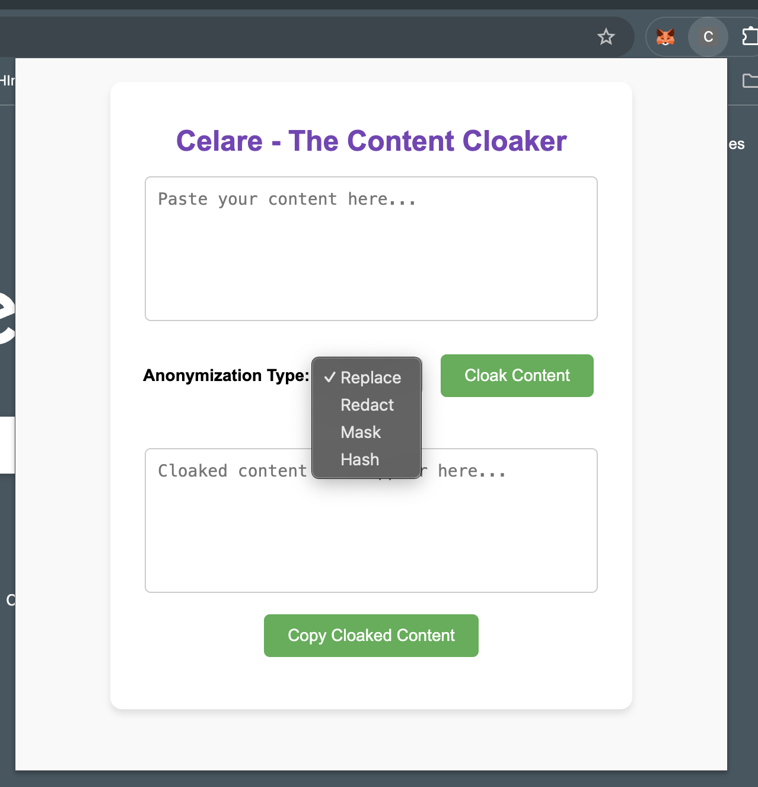
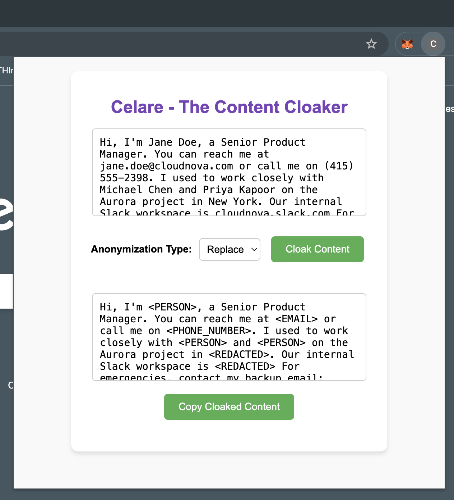
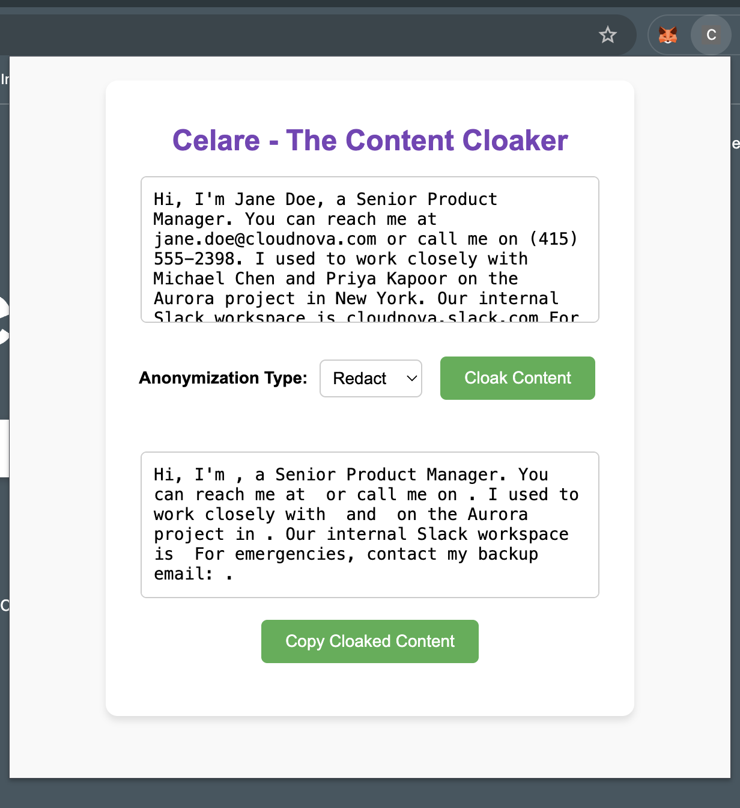
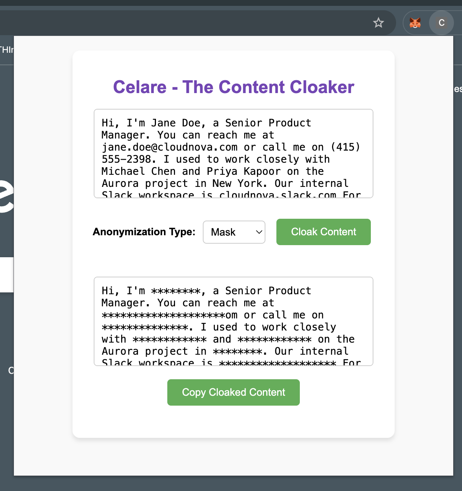
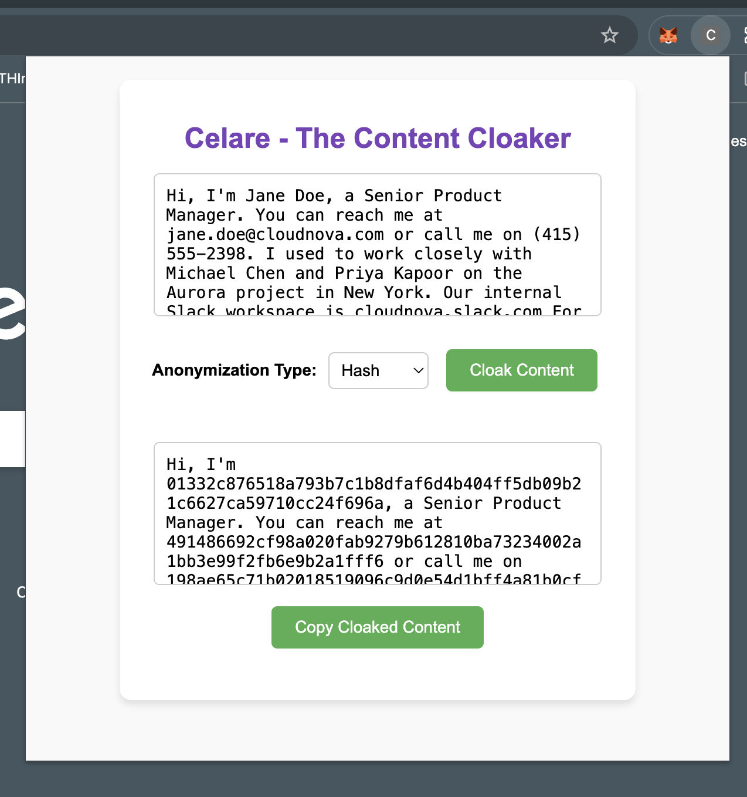

## Celare - The Content Cloaker 🔎

A Chrome extension that allows users to input any text and anonymize or "cloak" sensitive content. Perfect for removing confidential information from text before inputing to LLM or sharing it externally.

## 🔧 Anonymization Modes & UI Preview

| Mode     | Description                              | Screenshot |
|----------|------------------------------------------|------------|
| **Replace** | Replaces entities with tags like `<EMAIL>`, `<PERSON>` |  |
| **Redact**  | Completely removes detected entities     |  |
| **Mask**    | Masks entities with asterisks or symbols |  |
| **Hash**    | Replaces entities with hashed versions   |  |

---

🔐 Cloak before you prompt.
